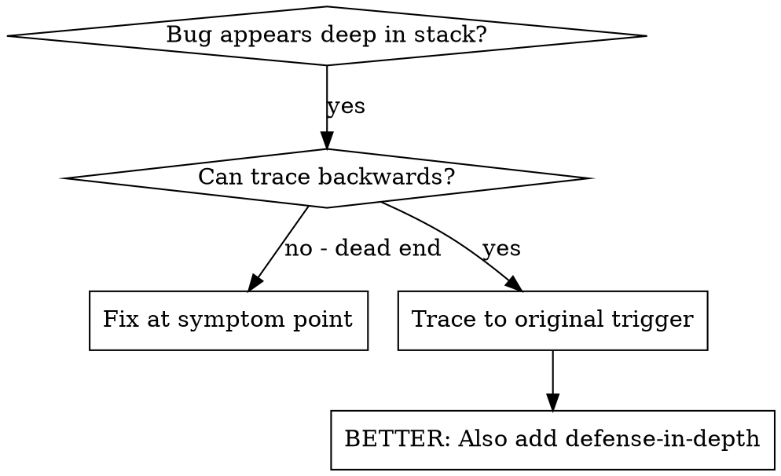
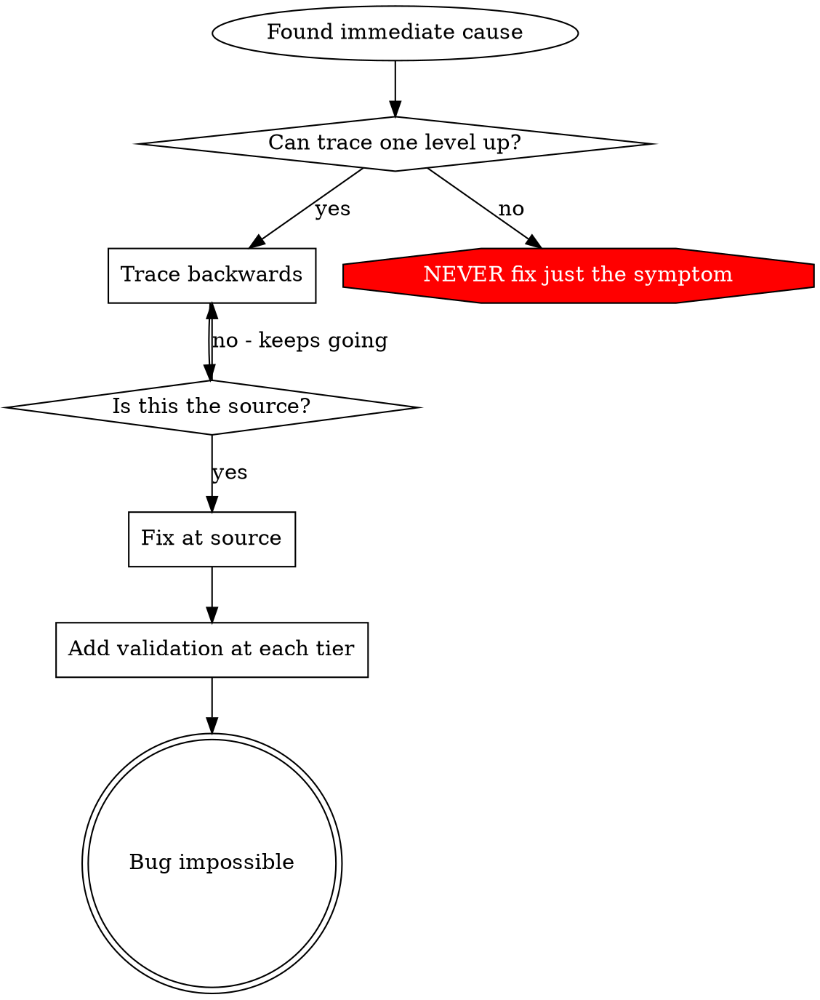

# Root Cause Tracing

## Overview

Bugs often manifest deep in the call stack (a file written to the wrong directory, a wrong value showing up in an output the user can see, a downstream consumer crashing on what looks like upstream's clean output). Your instinct is to fix where the error appears, but that's treating a symptom.

**Core principle:** Trace backward through the call chain until you find the original trigger, then fix at the source.

## When to Use

**Use when:**
- Error happens deep in execution (not at the entry point).
- Stack trace shows a long call chain.
- It's unclear where invalid data originated.
- You need to find which test or code path triggers the problem.

## The Tracing Process

### 1. Observe the symptom

State exactly what's wrong, including the error message, the file paths involved, and the conditions under which it happens. Don't paraphrase — read the actual error.

### 2. Find the immediate cause

Identify the specific line or function that directly produces the error. Use grep, "Go to Definition," or the debugger. This is the *symptom* point.

### 3. Ask: what called this?

Walk one frame up the stack. If a value is wrong here, where did it come from? Who passed it in? Don't guess — look at the actual call sites.

### 4. Keep tracing up

For each call site, ask the same question: where did the bad value come from? Continue until either:
- You find the source (a constant, a parsed input, a config setting, an off-by-one, a stale cache, a wrong default).
- The chain crosses a process or thread boundary, in which case instrument the boundary (see `defense-in-depth.md` and the multi-component evidence-gathering pattern in the parent `SKILL.md`).

### 5. Find the original trigger

The original trigger is where the wrong value first enters the system. That's the place to fix. Anything else is a band-aid that lets the bug re-emerge through a different code path.

## Adding instrumentation when manual tracing dead-ends

When you can't trace by reading, instrument:

- Add log lines (use the project's standard logging — in Lancet2 this is the `LOG_DEBUG` / `LOG_INFO` / `LOG_WARN` / `LOG_ERROR` macros from `src/lancet/base/logging.h`) at each suspected boundary.
- Capture the call site context: file, function, key variable values, thread identity if the operation is concurrent.
- For a one-shot stack trace at a specific point, use `absl::debugging::StackTrace` (already linked via abseil) or the platform's `backtrace()` facility.
- Run the failing scenario once with the instrumentation, redirect stderr to a file, and analyze the captured logs.

**Critical:** log *before* the dangerous operation, not after it fails. By the time the failure mode triggers, the relevant context may be lost.

**Common pitfall:** in tests, the project logger may be silenced or routed away from stdout. Either configure it to emit, or use `std::cerr` / `fmt::print(stderr, ...)` for the duration of the trace.

## Stack trace tips

- Log before the operation, not after it fails.
- Include enough context to identify the call site (function name, key inputs, thread identity).
- For concurrent code, note which jthread / worker the trace came from — the symptom in one worker may be caused by another worker's earlier action.
- Strip or guard the trace logging behind a debug-only macro before committing the fix; instrumentation is for debugging, not for the steady-state codebase.

## Key Principle

**NEVER fix just where the error appears.** Trace back to find the original trigger.

After fixing at the source, follow `defense-in-depth.md` to make the bug structurally impossible by adding validation at the tiers in between.
