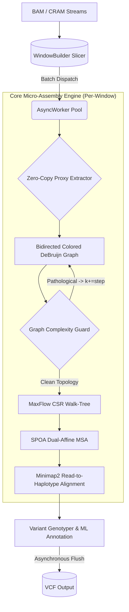

# Lancet2 Pipeline Architecture

Lancet2 is designed as a highly specialized *de novo* micro-assembly engine. Instead of globally mapping reads against a linear reference like traditional variant callers, the system slices the genome into ~1kbp windows and natively re-assembles the physical reads from scratch. This guarantees the highest possible sensitivity when detecting complex multi-nucleotide variants and micro-indels. 

The core engine is invoked via the `Lancet2 pipeline` command, which orchestrates the entirely asynchronous assembly topology across the available core limit boundaries. 

## The High-Level Engine Workflow

## 1. Zero-Copy Sequence Ingestion
The pipeline natively leverages streaming `htslib` APIs to fetch regions dynamically—meaning users can execute processing workflows directly against remote immutable Cloud datasets (AWS S3, GCP) to completely bypass local mounting bandwidth. 

Rather than indiscriminately deep-copying sequence strings locally once the reads are fetched, Lancet2 utilizes a **Zero-Copy Proxy Abstraction** holding direct pointers in the stream. Uniform downsampling is natively enforced dynamically to heavily cap memory footprints across aggressive `2000x` tumor regimes without breaking mate-pair links.

* **User Tuning:** Use `--max-sample-cov` to scale the absolute coverage limit for heavy arrays. During ingest initialization, if the engine detects that your BAM lacks the standard aligner `MD` sequence tags, the pipeline automatically toggles `--no-active-region` on your behalf to safely enforce evaluation blindly across all regions, completely bypassing localized fast-tracking skips.

* **Read more:** [Native Cloud Streaming](cloud_streaming.md)

## 2. Bidirected Graph Construction
Within each window, normal and tumor sequences are split into specific `k`-mer chunks to construct a tightly localized, colored Bidirected De Bruijn Graph. Divergent branches represent specific variations in structure, differentiating inherited genetic traits directly from newly emerged somatic mutation signatures. 
Lancet2 recursively iterates graph construction incrementally starting from `-k` sizes up to `-K`, sliding forward each cycle by `-s`. 

* **User Tuning:** You can override the absolute boundaries (`-k`, `-K`) for long-read or short-fragment assemblies. If the localized graph contains massive noise artifacts from low-coverage fragments masking true patterns, you can adjust `--min-node-cov` to aggressively snap dead branches prior to routing calculations, isolating the most dominant tumor signatures. Note that increasing this value can cut down the runtime of Lancet2 dramatically, but it comes at the cost of lower subclonal sensitivity.

## 3. The Structural Complexity Guard
Tandem repetitive arrays biologically provoke exponential internal traversal state explosions that crash engine runs or force them into indefinite looping. Before any traversal happens, Lancet2 measures the topology via an absolute `O(V+E)` **Complexity Guard** using Cyclomatic Complexity (CC) and Branch Points (BP) to identify tangled cyclic structures. If the engine strictly mathematically diagnoses a pathological tandem repeat structure natively, the loop silently aborts execution of the current k-mer tier and natively overrides to immediately retry graph construction with a significantly expanded k-size. This effortlessly slices runtime bottleneck stalls by 10x-50x without sacrificing base subclonal sensitivity profiles.

* **Read more:** [Graph Complexity](graph_complexity.md)

## 4. Max-Flow Walk Enumerations
Once the geometry passes the complexity guard, Lancet2 physically flattens the graph into a **Compressed Sparse Row (CSR)** matrix index, accelerating memory hops down to zero-cache-miss cycles. 

A Breadth-First MaxFlow search scans from the physical Source to the Sink, sequentially tracing all biologically valid haplotype sequences out of the array. Because the queue leverages Google's `chunked_queue` to cache parent pointers across continuous 16-byte arenas, the engine reliably slices through intensive loop mappings safely generating output sequences absent of heap bloat variables.

## 5. MSA & Haplotype Alignment
Individual completed walks are dynamically aligned together into a standard unified column-system matrix using **SPOA (SIMD Partial Order Alignment)**. Lancet2 leverages an intentionally engineered *Convex Dual-Affine* gap penalty logic strictly weighted for oncology profiles—favoring discrete local SNP clustering versus aggressively crushing variables inside synthetic long gap deletions. 

Once the variant haplotypes are constructed from the MSA, Lancet2 utilizes custom `minimap2` interfaces to align the raw window reads back directly to the assembled haplotypes, enabling highly precise variant allele genotyping and likelihood scoring.

* **Read more:** [Alignment-Derived Annotations](alignment_annotations.md)

## 6. Coverage-Invariant ML Genotyping
In the final stream sequence, the finalized variants are statistically scored. Traditional variant callers historically output direct significance test models (P-Values) that rapidly break boundary generalizations inside differing read-depth domains natively. Lancet2 radically bypasses this by exclusively computing coverage-invariant metrics: standard deviations to bounded effect-sizes (**Cohen's D**), geometric **Polar Coordinates** tracking allele frequency ratios efficiently, and **LongdustQ / Shannon Entropy** models generating uniform, continuous sequence signatures directly mapped into the VCF.

* **Read more:** [Sequence Complexity](sequence_complexity.md), [Polar Coordinate Features](polar_features.md), [VCF Output Reference](vcf_output.md), [Scoring Somatic Variants](scoring_somatic_variants.md)
