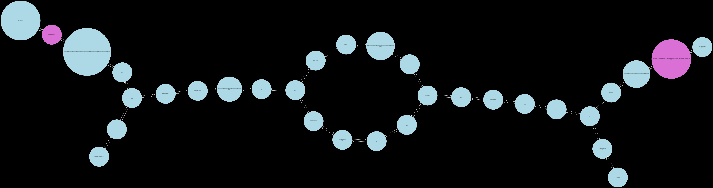
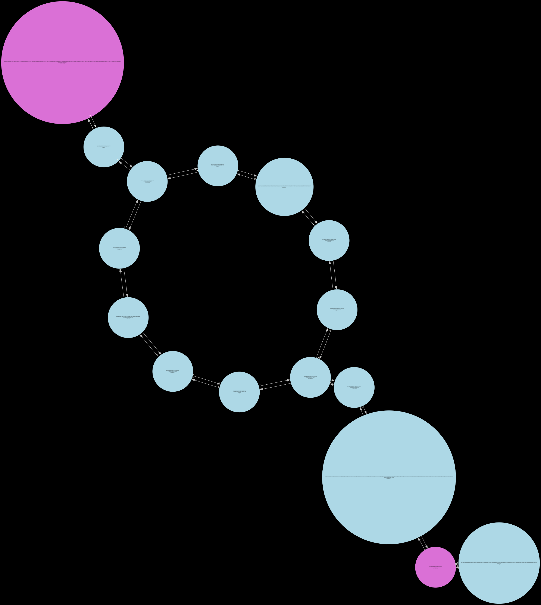
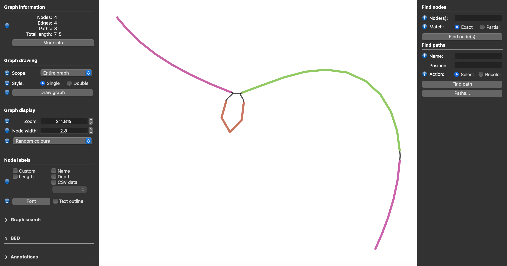

# Custom Visualization

For each window being processed, Lancet2 can optionally serialize two types of graphs that are generated during the variant calling process.
This can be enabled by passing a non-existing directory to the `--graphs-dir` flag to write per window serialized graphs in the directory.

1. the kmer-based colored de-bruijn overlap graph after the cleaning/pruning steps of the assembly
   process serialized as `DOT` formatted [graphviz](https://www.graphviz.org/) files. One `DOT` file
   is generated for every strongly connected component for each window.

2. the sequence graph generated from the multiple sequence alignment of all the assembled contigs
   from the de-bruijn graph assembly serialized as `GFA` formatted files.

```bash
Lancet2 pipeline --reference ref.fasta \
    --tumor tumor.bam --normal normal.bam \
    --region "chr22" --graphs-dir output-graphs
```

The above command will create two directories named `dbg_graph` and `poa_graph` in the provided `output-graphs` directory.

- In the `dbg_graph` directory, you will find the `DOT` files generated for each window –
  `dbg__${CHROM}_${START}_${END}__fully_pruned__k${KMER_SIZE}__comp${COMP_ID}.dot`

- In the `poa_graph` directory, you will find the `GFA` files generated for each window –
  `msa__${CHROM}_${START}_${END}__c${COMP_ID}.gfa`
  The `poa_graph` also contains a `FASTA` file with the raw multiple sequence alignment output.

!!! info "Info"

    If you are interested to further debug the de-bruijn graph assembly process, you can generate DOT files for the all the
    intermediate steps before the `fully_pruned` graph is generated, by re-compiling the Lancet2 binary in `Debug` mode using
    `-DCMAKE_BUILD_TYPE=Debug` instead of `-DCMAKE_BUILD_TYPE=Release` in the cmake step.

    The intermediate states that can be inspected in their order of generation are as follows –
    `low_cov_removal1`, `found_ref_anchors`, `compression1`, `low_cov_removal2`, `compression2`, `short_tip_removal`.

## Inspecting `DOT` formatted assembly graphs

The `DOT` files can be rendered in the pdf format using the dot utility available in
the [graphviz](https://www.graphviz.org/) visualization software package. The `DOT`
file can also be exported to various other [output formats](https://graphviz.org/docs/outputs/)
with the dot utility tool.

```bash
dot -Tpdf -o example_file.pdf example_file.dot
```

The above command will create a example_file.pdf file that shows the de-bruijn assembly graph.

Shown below are the renderings of the de-bruijn assembly graph through all of it's intermediate
states (can only be visualized in `Debug` mode Lancet2 binary. ideal for small regions.).

!!! note "Note"

    Only the `fully_pruned` graph will be serialized when the standard `Release` build is used.
    The remaining 6 other states can only be visualized in the `Debug` build of Lancet2.
    The `Debug` build is much slower than the standard `Release` build and is only recommended
    to be used on small regions for inspection.


#### `low_cov_removal1`
{ align=left, loading=lazy }

#### `found_ref_anchors`
{ align=left, loading=lazy }

#### `compression1`
{ align=left, loading=lazy }

#### `low_cov_removal2`
{ align=left, loading=lazy }

#### `compression2`
{ align=left, loading=lazy }

#### `short_tip_removal`
{ align=left, loading=lazy }

#### `fully_pruned`
{ align=left, loading=lazy }

## Inspecting `GFA` formatted sequence graphs

The generated [`GFA`](https://github.com/GFA-spec/GFA-spec) files can be visualized in
[Bandage](https://github.com/rrwick/Bandage) or [BandageNG](https://github.com/asl/BandageNG).

The GFA file generated by Lancet2 is chopped i.e the nodes are in their decomposed form. They
need to be unchopped using the [`vg toolkit`](https://github.com/vgteam/vg/releases), before
they can be visualized or used in other downstream processes. Below is a command to unchop
the Lancet2 GFA graph.

```bash
vg mod --unchop ${INPUT_GFA} > ${OUTPUT_GFA}
```

#### BandageNG
{ align=left, loading=lazy }

The image above shows a screenshot of an unchopped Lancet2 sequence graph in `GFA` format
visualized using the BandageNG toolkit.

#### Sequence Tube Map
Lancet2 addresses the longstanding challenge of visualizing variants along with supporting reads from multiple samples in graph space.
Users can easily load the unchopped `GFA` formatted graphs into the Sequence Tube Map environment allowing somatic variants' visualization
along with their supporting read alignments from multiple samples.

The following steps describe the workflow to visualize Lancet2 variants of interest in graph space using the Sequence Tube Map framework.

1. Install prerequisite tools – Lancet2 (https://github.com/nygenome/Lancet2), samtools, bcftools, vg version 1.59.0,
and jq, and ensure that they are available as commands that can be executed in the environment PATH.

2. Install Sequence Tube Map (https://github.com/vgteam/sequenceTubeMap) version [0452ecb82d057372e359a9b456d789336e5ab8a1](https://github.com/vgteam/sequenceTubeMap/tree/0452ecb82d057372e359a9b456d789336e5ab8a1).

3. Use the Lancet2’s prep_stm_viz.sh script to run Lancet2 on a small set of variants of interest that need to be
   visualized in Sequence Tube Map. The script will run Lancet2 using the --graph-dir flag to generate GFA formatted
   sequence graphs for each variant of interest. Local VG graphs and indices required to load the sample reads along
   with the Lancet2 graph are then constructed enabling simplified use with “custom” data option in Sequence Tube Map interface.

4. After running the Sequence Tube Map Server as detailed in the Tube Map Readme, set “Data” to “custom” and “BED file”
   to “index.bed”. Pick a “Region”(or variant) of interest and hit “Go” to visualize.

##### Demo Sequence Tube Map server
Sequence Tube Map demo server containing somatic variants from COLO829 tumor/normal pair
sample can be found at this link – https://shorturl.at/JQZsy
