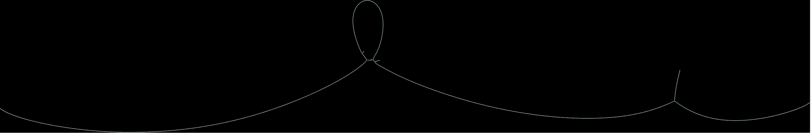
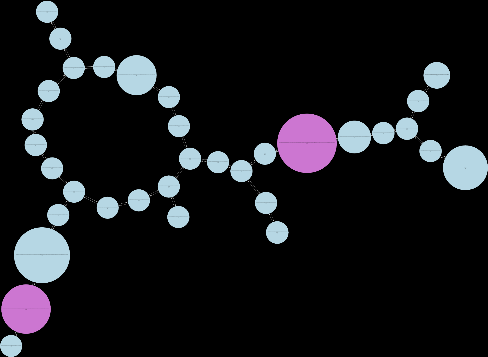
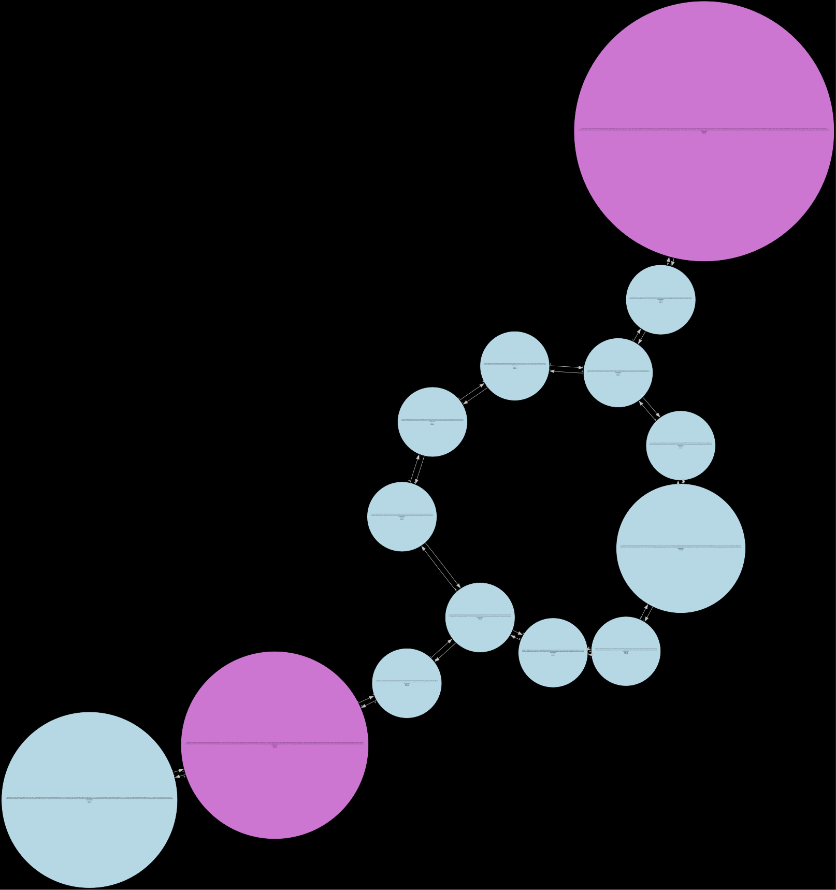
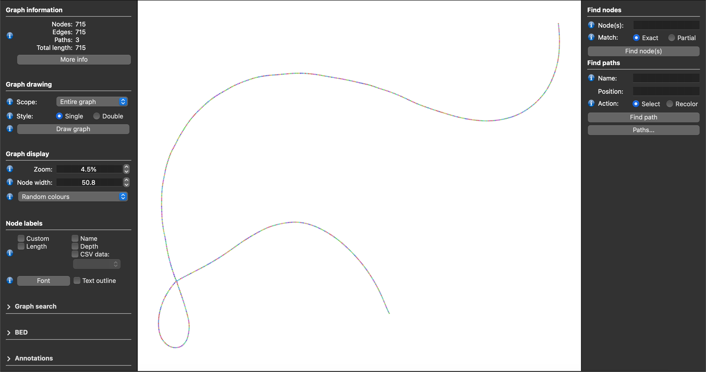
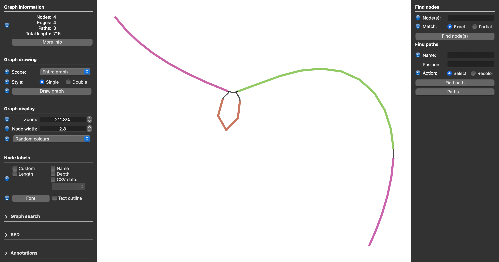

# Graph Visualization

By passing the ```--graphs-dir``` parameter and providing a directory where you want the graphs to be placed, Lancet will write deBruijn graphs for each window inspected and place them into directories within the designated graphs directory. NOTE: whichever directory is given as the graphs-dir will be cleared so be mindful of what directory you provide.

```bash
lancet2 pipeline -t tumor.bam -n normal.bam -r ref.fasta --graphs-dir ./graphs
```

The above command will create dbg_graph and poa_graph directories in the provided ./graphs directory. In the dbg_graph directory, you will find the dot files generated by the tool for each window. In the poa_graph directory, you will find the gfa graphs generated for each window along with an accompanying fasta file

## deBruijn DOT graphs
The dot files can be rendered using the dot utility available in the [Graphviz](http://www.graphviz.org/) visualization software package.

```bash
dot -Tpdf -o example_file.pdf example_file.dot
```

The above command will create a example_file.pdf file that shows the graph. For large graphs, Adobe Acrobat Reader may have troubles rendering the graph in which case we recommend opening the PDF file using the "Preview" image viewer software available in MacOS.

Below are examples of some of the debruijn graph as it comes out raw (a), after some compression (b), and then finally fully pruned (c)
(a) (b) (c)

## GFA graphs
The generated gfa files can be viewed using the [Bandage-NG](https://github.com/asl/BandageNG) program.

By loading these gfa files directly into Bandage-NG and viewing the graphs, you get something that looks like this:


By adding an additional step of using the unchop command in the [vg](https://github.com/vgteam/vg) repository, the GFAs can be simplified such that nodes are combined by removing edges where doing so has no effect on the graph. Here is the general command for unchopping the gfa along with the resulting graph of the same window:
```bash
vg mod --unchop $INPUT_GFA > $OUTPUT_GFA
```

